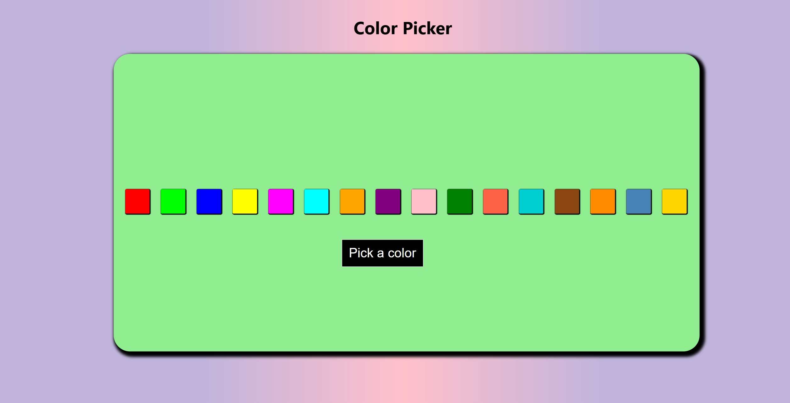

# 🎨 Color Picker (React)

An interactive React application that allows users to pick a color from a custom palette and instantly updates the background to reflect the selected color. Built as part of a React learning task to practice state management and dynamic styling.

🔗 **Live Demo:** [https://task-3-react-js.vercel.app/](https://task-3-react-js.vercel.app/)

---

## 🚀 Features

- Click-to-select color from a predefined palette  
- Dynamically updates the background color in real-time  
- Responsive layout and clean design  
- Built using React functional components and hooks

---

## 📸 Screenshot

### 🏠 Home Page

This is the initial view of the app when loaded.



---

## ⚙️ Tech Stack

- ReactJS  
- HTML5 & CSS3  
- JavaScript (ES6)

---

## 📦 Installation & Setup

1. **Clone the repository:**
   ```bash
   git clone https://github.com/yaswantharao05/Color-Picker-React.git
   cd color-picker-react
